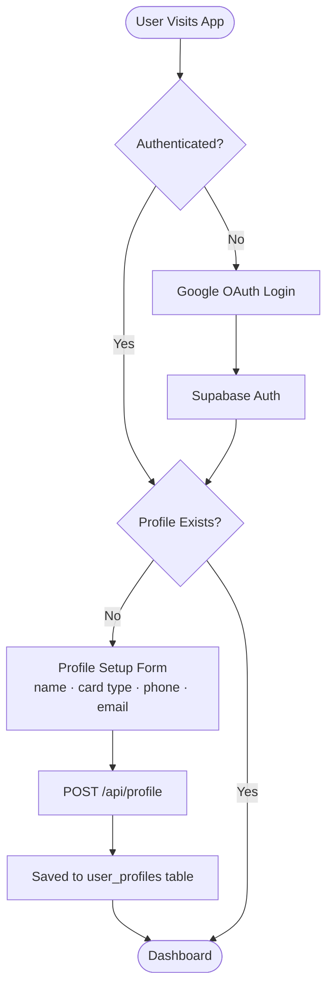
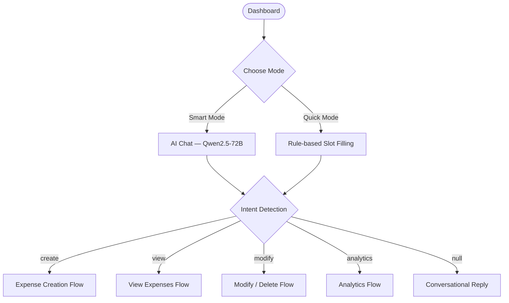
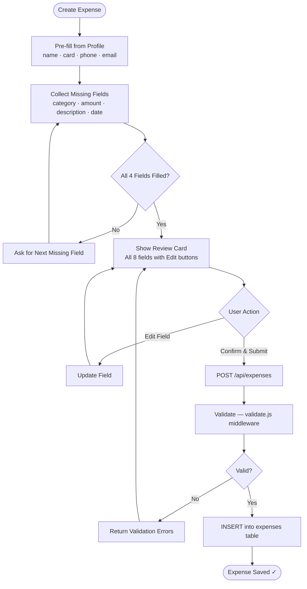
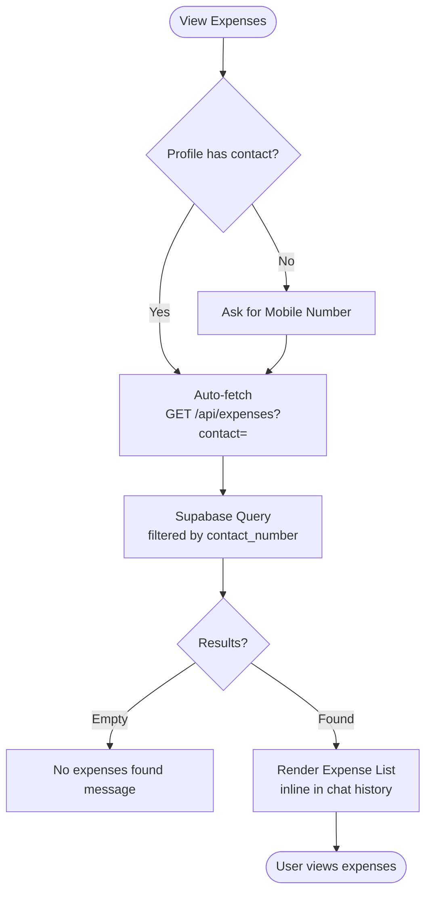
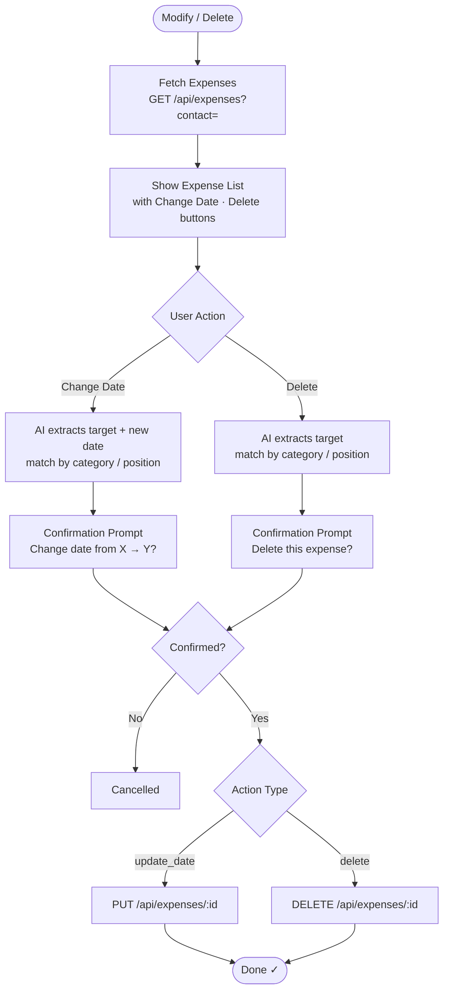
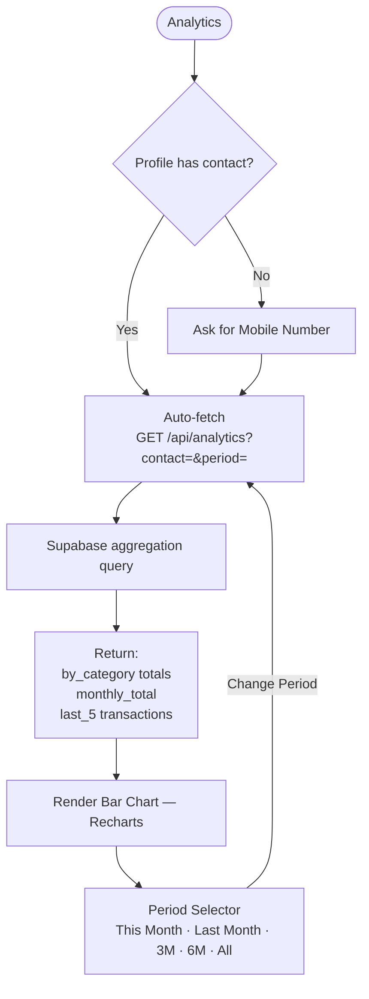

# Personal Finance Tracker — Flow Diagram
**Yogeshwara B | PS3**

---

## 1. Authentication & Profile Setup

---

## 2. Dashboard — Mode Selection

---

## 3. Expense Creation Flow

---

## 4. View Expenses Flow

---

## 5. Modify / Delete Flow

---

## 6. Analytics Flow

---

## 7. AI Conversation Flow (Smart Mode)

```mermaid
flowchart TD
    J([Smart Mode Message]) --> J1[Send to POST /api/ai-chat\nmessage + history + slots + profile]
    J1 --> J2[Qwen2.5-72B processes\nwith system prompt]
    J2 --> J3[Returns JSON\nreply · fields · intent]
    J3 --> J4{Intent?}
    J4 -->|create| J5[Merge extracted fields into slots]
    J4 -->|view| J6[Fetch expenses]
    J4 -->|modify| J7{Has action fields?}
    J4 -->|analytics| J8[Open analytics dashboard]
    J4 -->|null| J9[Show reply only]
    J5 --> J10{All expense fields filled?}
    J10 -->|No| J11[Show AI reply\nask for next field]
    J10 -->|Yes| J12[Show Review Card]
    J7 -->|Yes| J13[Confirmation prompt\nthen execute API call]
    J7 -->|No| J6
```

